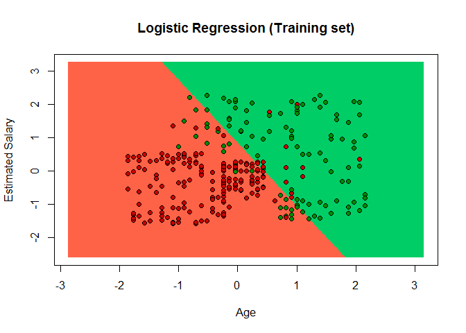
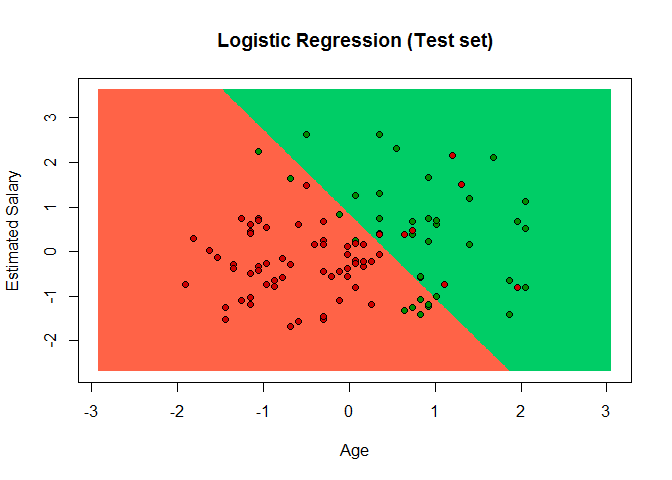

Logistic Regression
================

Showing our Data
================

``` r
social=read.csv('file:///D:/Machine Learning A-Z Template Folder/Part 3 - Classification/Section 14 - Logistic Regression/Social_Network_Ads.csv')
social=social[,3:5]
library(knitr)
library(dplyr)
library(caTools)
library(ElemStatLearn)
kable(social[1:10,])
```

|      Age|    EstimatedSalary|                           Purchased|
|--------:|------------------:|-----------------------------------:|
|       19|              19000|                                   0|
|       35|              20000|                                   0|
|       26|              43000|                                   0|
|       27|              57000|                                   0|
|       19|              76000|                                   0|
|       27|              58000|                                   0|
|       27|              84000|                                   0|
|       32|             150000|                                   1|
|       25|              33000|                                   0|
|       35|              65000|                                   0|
|  \# Spli|  tting the dataset|  into the Training set and Test set|

``` r
set.seed(123)
split = sample.split(social$Purchased, SplitRatio = 0.75)
training_set = subset(social, split == TRUE)
test_set = subset(social, split == FALSE)
```

Feature Scaling
===============

``` r
training_set[,1:2] = scale(training_set[,1:2])

test_set[,1:2] = scale(test_set[,1:2])
```

Fitting Logistic Regression to the Training set
===============================================

``` r
classifier = glm(formula = Purchased ~ .,
                 family = binomial,
                 data = training_set)
```

Predicting the Test set results
===============================

``` r
prob_pred = predict(classifier, type = 'response', newdata = test_set[-3])
y_pred = ifelse(prob_pred > 0.5, 1, 0)
```

Calculating the accuracy of the prediction.
===========================================

``` r
cm = table(test_set[, 3], y_pred > 0.5)
```

Visualising the Training set results
====================================

``` r
set = training_set
X1 = seq(min(set[, 1]) - 1, max(set[, 1]) + 1, by = 0.01)
X2 = seq(min(set[, 2]) - 1, max(set[, 2]) + 1, by = 0.01)
grid_set = expand.grid(X1, X2)
colnames(grid_set) = c('Age', 'EstimatedSalary')
prob_set = predict(classifier, type = 'response', newdata = grid_set)
y_grid = ifelse(prob_set > 0.5, 1, 0)
plot(set[, -3],
     main = 'Logistic Regression (Training set)',
     xlab = 'Age', ylab = 'Estimated Salary',
     xlim = range(X1), ylim = range(X2))
contour(X1, X2, matrix(as.numeric(y_grid), length(X1), length(X2)), add = TRUE)
points(grid_set, pch = '.', col = ifelse(y_grid == 1, 'springgreen3', 'tomato'))
points(set, pch = 21, bg = ifelse(set[, 3] == 1, 'green4', 'red3'))
```

 \# Visualising the Test set results

``` r
set = test_set
X1 = seq(min(set[, 1]) - 1, max(set[, 1]) + 1, by = 0.01)
X2 = seq(min(set[, 2]) - 1, max(set[, 2]) + 1, by = 0.01)
grid_set = expand.grid(X1, X2)
colnames(grid_set) = c('Age', 'EstimatedSalary')
prob_set = predict(classifier, type = 'response', newdata = grid_set)
y_grid = ifelse(prob_set > 0.5, 1, 0)
plot(set[, -3],
     main = 'Logistic Regression (Test set)',
     xlab = 'Age', ylab = 'Estimated Salary',
     xlim = range(X1), ylim = range(X2))
contour(X1, X2, matrix(as.numeric(y_grid), length(X1), length(X2)), add = TRUE)
points(grid_set, pch = '.', col = ifelse(y_grid == 1, 'springgreen3', 'tomato'))
points(set, pch = 21, bg = ifelse(set[, 3] == 1, 'green4', 'red3'))
```


